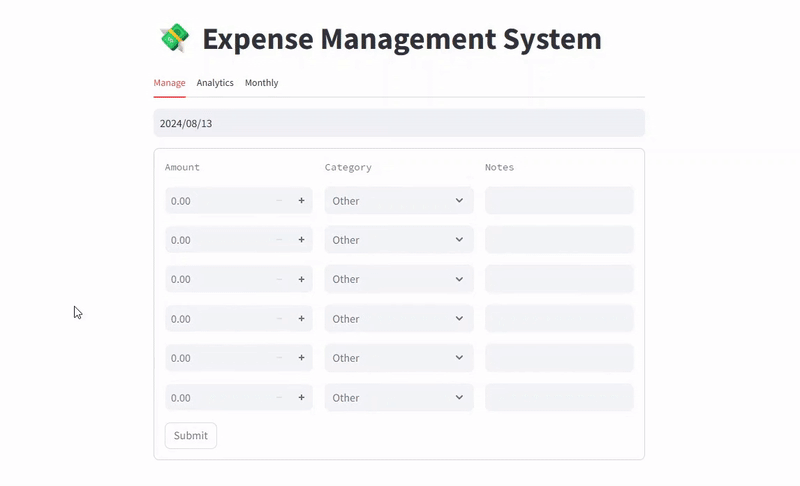

# Expense Tracking System
This is an expense tracking system that consist streamlit frontend and FastAPI backend server. 
<br> This application consist of:
* manage expense
* analytics
* monthly summary


## Demo



## Tech Architecture


## Project Structure
- **frontend/**: Contain the streamlit applicaiton code.
- **backend/**: Contains the FastAPI backend server code.
- **tests/**: Contains test cases for both frontend and backend.
- **requirements.txt/**: List of required python packages.


## Setup Instructions
1. **Clone the repository**:
```
https://github.com/lintosunny/Expense-Tracking-System.git
```

2. **Install dependencies**:
```
pip install -r requirements.txt
```

3. **Create ```.env``` file on root dir**:
```
HOST="localhost"
USER="root"
PASSWORD="password"
DATABASE="database_name"
```

4. **Run the FastAPI server**:
```
uvicorn server.server:app --reload
```

5. **Run the Streamlit app**:
```
streamlit run frontend/app.py
```


